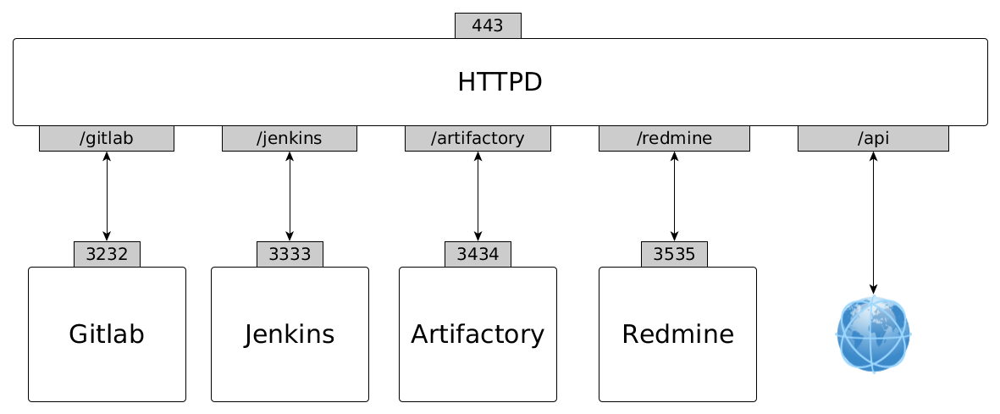
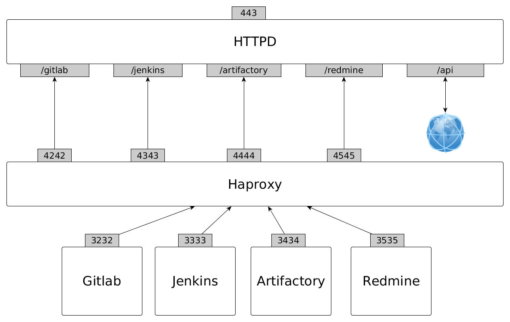

## Proxy config template

Some proxy configuration template with TLS termination using :

* Httpd alone
* Httpd + Haproxy

Services used in these templates are :

| service     | endpoint     |
|-------------|--------------|
| gitlab      | /gitlab      |
| redmine     | /redmine     |
| jenkins     | /jenkins     |
| artifactory | /artifactory |
| some api endpoint | /api   |

### Httpd alone



#### Resource location

|  Path         |  Location URL                     |
|---------------|-----------------------------------|
|  /api         |  https://foo.bar.com              |      
|  /redmine     |  http://localhost:3535/redmine    |
|  /gitlab      |  http://localhost:3232/gitlab     |
|  /jenkins     |  http://localhost:3333/jenkins    |
|  /artifactory |  http://localhost:3434/artifactory |

#### Certificates location

| path                                       |  description     |
|--------------------------------------------|------------------|
| /usr/local/apache2/conf/key/fullchain.pem  |  full chain      |
| /usr/local/apache2/conf/key/privkey.pem    |  private key     |

#### Configuration

```ApacheConf
<VirtualHost *:80>
    RewriteEngine On
    RewriteCond %{HTTPS} off
    RewriteRule (.*) https://%{HTTP_HOST}%{REQUEST_URI}
</VirtualHost>

<VirtualHost *:443>

    SSLEngine on
    SSLCertificateFile    "/usr/local/apache2/conf/key/fullchain.pem"
    SSLCertificateKeyFile "/usr/local/apache2/conf/key/privkey.pem"
    SSLProxyEngine On
    RequestHeader set Front-End-Https "On"
    RequestHeader set X-Forwarded-Proto "https"

    ProxyPass           /api                 https://foo.bar.com
    ProxyPassReverse    /api                 https://foo.bar.com

    ProxyPass           /redmine/stylesheets http://localhost:3535/stylesheets
    ProxyPassReverse    /redmine/stylesheets http://localhost:3535/stylesheets
    ProxyPass           /redmine/javascripts http://localhost:3535/javascripts
    ProxyPassReverse    /redmine/javascripts http://localhost:3535/javascripts
    ProxyPass           /redmine/images      http://localhost:3535/images
    ProxyPassReverse    /redmine/images      http://localhost:3535/images
    ProxyPass           /redmine             http://localhost:3535/redmine
    ProxyPassReverse    /redmine             http://localhost:3535/redmine

    ProxyPass           /gitlab              http://localhost:3232/gitlab
    ProxyPassReverse    /gitlab              http://localhost:3232/gitlab

    ProxyPass           /jenkins             http://localhost:3333/jenkins
    ProxyPassReverse    /jenkins             http://localhost:3333/jenkins

    ProxyPass           /artifactory         http://localhost:3434/artifactory
    ProxyPassReverse    /artifactory         http://localhost:3434/artifactory

</VirtualHost>
```

### Httpd + Haproxy

Haproxy can also be used to load balance behind Httpd. Httpd here is used to SSL terminate and manage base URL



#### Haproxy

```
frontend artifactory-http
  bind 0.0.0.0:4444
  default_backend artifactory-backend

backend artifactory-backend
  server artifactory-1 localhost:3434 check

frontend gitlab-http
  bind 0.0.0.0:4242
  default_backend gitlab-backend

backend gitlab-backend
  server git-1 localhost:3232 check

frontend jenkins-http
  bind 0.0.0.0:4343
  default_backend jenkins-backend

backend jenkins-backend
  server jenkins-1 localhost:3333 check

frontend redmine-http
  bind 0.0.0.0:4545
  default_backend redmine-backend

backend redmine-backend
  server redmine-1 localhost:3535 check
```

#### Httpd

```ApacheConf
<VirtualHost *:80>
    RewriteEngine On
    RewriteCond %{HTTPS} off
    RewriteRule (.*) https://%{HTTP_HOST}%{REQUEST_URI}
</VirtualHost>

<VirtualHost *:443>

    SSLEngine on
    SSLCertificateFile    "/usr/local/apache2/conf/key/fullchain.pem"
    SSLCertificateKeyFile "/usr/local/apache2/conf/key/privkey.pem"
    SSLProxyEngine On
    RequestHeader set Front-End-Https "On"
    RequestHeader set X-Forwarded-Proto "https"

    ProxyPass           /api                 https://foo.bar.com
    ProxyPassReverse    /api                 https://foo.bar.com

    ProxyPass           /redmine/stylesheets http://localhost:4545/stylesheets
    ProxyPassReverse    /redmine/stylesheets http://localhost:4545/stylesheets
    ProxyPass           /redmine/javascripts http://localhost:4545/javascripts
    ProxyPassReverse    /redmine/javascripts http://localhost:4545/javascripts
    ProxyPass           /redmine/images      http://localhost:4545/images
    ProxyPassReverse    /redmine/images      http://localhost:4545/images
    ProxyPass           /redmine             http://localhost:4545/redmine
    ProxyPassReverse    /redmine             http://localhost:4545/redmine

    ProxyPass           /gitlab              http://localhost:4242/gitlab
    ProxyPassReverse    /gitlab              http://localhost:4242/gitlab

    ProxyPass           /jenkins             http://localhost:4343/jenkins
    ProxyPassReverse    /jenkins             http://localhost:4343/jenkins

    ProxyPass           /artifactory         http://localhost:4444/artifactory
    ProxyPassReverse    /artifactory         http://localhost:4444/artifactory

</VirtualHost>
```

